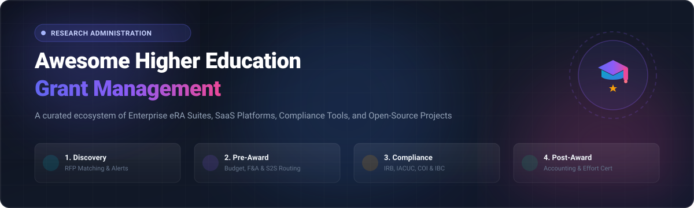

# 🎓 Awesome Higher Education Grant Management

<p align="center">
  
</p>

<div align="center">

<a href="https://github.com/ishandutta2007/Awesome-Awesome-Awesome"></a><a href="https://discord.gg/jc4xtF58Ve"></a> <a href="https://github.com/ishandutta2007/Awesome-Higher-Education-Grant-Management/stargazers"></a> <a href="https://github.com/ishandutta2007/Awesome-Higher-Education-Grant-Management/network/members"></a> <a href="https://github.com/ishandutta2007/Awesome-Higher-Education-Grant-Management/blob/main/LICENSE"></a> <a href="https://github.com/ishandutta2007/Awesome-Higher-Education-Grant-Management/pulls"></a> <a href="https://github.com/ishandutta2007"></a>

</div>

---

> 🏛️ **A curated ecosystem of SaaS platforms, enterprise Electronic Research Administration (eRA) suites, and open-source GitHub projects** designed for universities, academic medical centers, research institutions, sponsored programs offices, principal investigators (PIs), and philanthropic funding organizations.

---

## 📑 Table of Contents

- [🔍 Overview & Research Administration Lifecycle](#-overview--research-administration-lifecycle)
- [☁️ SaaS & Commercial Hosted Platforms](#️-saas--commercial-hosted-platforms)
- [💻 Open-Source GitHub Projects](#-open-source-github-projects)
- [🧩 Open-Source Modular Building Blocks](#-open-source-modular-building-blocks)
- [🤝 How to Contribute](#-how-to-contribute)
- [⭐ Star History](#-star-history)
- [⚖️ Disclaimer](#️-disclaimer)

---

## 🔍 Overview & Research Administration Lifecycle

Grant management in higher education covers complex institutional workflows spanning the entire research funding lifecycle:

```
  ┌─────────────────┐      ┌────────────────────┐      ┌────────────────────┐      ┌────────────────────┐
  │ 🔭 1. DISCOVERY │ ───► │ 📝 2. PRE-AWARD    │ ───► │ 🛡️ 3. COMPLIANCE   │ ───► │ 💰 4. POST-AWARD   │
  │ • Funding RFPs  │      │ • Budgeting & F&A  │      │ • IRB / Human Subj │      │ • Fund Accounting  │
  │ • Sponsor Match │      │ • Routing & S2S    │      │ • IACUC / Animals  │      │ • Effort Cert      │
  │ • Faculty Alert │      │ • Internal Approvals│      │ • COI & Export Ctrl│      │ • Closeout & Audit │
  └─────────────────┘      └────────────────────┘      └────────────────────┘      └────────────────────┘
```

- **🔭 Funding Discovery & Intelligence**: Automated matching of federal, state, and private foundation solicitations against researcher profile keywords.
- **📝 Pre-Award & Proposal Routing**: Multi-investigator budget development, Facilities & Administrative (F&A) indirect cost rate calculations, cost sharing, and System-to-System (S2S) submission to federal portals (e.g., Grants.gov, NIH ASSIST, NSF Research.gov).
- **🛡️ Research Integrity & Compliance**: Tracking human subjects research (IRB), animal welfare (IACUC), Conflicts of Interest (COI), bio-safety (IBC), and export control regulations.
- **💰 Post-Award Administration**: Grant accounting, subrecipient monitoring, invoicing, financial reporting, time & effort certification (Uniform Guidance 2 CFR 200), milestone tracking, and audit-ready project closeout.

---

## ☁️ SaaS & Commercial Hosted Platforms

> 📊 **Sector Market Size & Industry Dynamics:** The global Higher Education and Research Grant Management Software market is estimated at **$2.2 Billion – $3.6 Billion USD** (expanding at an estimated **9.8% – 12.4% CAGR**). The sector is **moderately fragmented** rather than concentrated into a winner-take-all monopoly: enterprise Electronic Research Administration (eRA) suites (e.g., Huron, Cayuse, InfoEd, Kuali) control high-complexity R1/R2 university pre- and post-award administration; public sector suites (e.g., Euna, AmpliFund) govern government and subrecipient compliance; foundation platforms (e.g., Blackbaud, SmartSimple, Fluxx) dominate philanthropic grantmaking; and agile SaaS innovators (e.g., Instrumentl, OpenGrants) rapidly capture researcher-level discovery and pre-award intelligence.

*The table below is sorted in descending order by estimated company scale (annual revenue / valuation).*

| Platform / Product | Description | Company Scale / Valuation (Est.) | Pricing (Starting Tier) | Free Tier / Free Trial Limits |
| :--- | :--- | :--- | :--- | :--- |
| **Pivot-RP** | Research-development and funding-opportunity platform used by universities and research institutions worldwide to discover grants, fellowships, and funding calls. | **~$2.6B Revenue / ~$3.5B Market Cap** *(Clarivate - NYSE: CLVT)* | Starts at ~$6,500–$12,000/year (institutional subscription tiered by Carnegie classification, FTE, and research volume) | 30-day to 4-month institutional evaluation trial (full campus researcher access and funding alert matching; no individual free-forever tier) |
| **Huron Research Suite** | Comprehensive higher-education research administration suite supporting pre-award, post-award, compliance (IRB, IACUC, COI), research development, and sponsored project workflows. | **~$1.4B Revenue / ~$2.1B Market Cap** *(Huron Consulting - NASDAQ: HURN)* | Starts at ~$50,000/year (single module; comprehensive institutional suites start at ~$500,000/year across multi-year enterprise agreements) | No free-forever tier; no open trial (institutional readiness assessment and guided demo on request) |
| **Blackbaud Grantmaking** | Enterprise grantmaking and philanthropic portfolio management platform supporting application review, award disbursement, compliance, and foundation reporting. | **~$1.15B Revenue / ~$3.8B Market Cap** *(Blackbaud - NASDAQ: BLKB)* | Starts at ~$15,000–$25,000/year (entry foundation tier; includes complimentary view-only licenses per paid seat) | No free-forever tier; no open trial (tailored live demonstration and capability walk-through upon request) |
| **SurveyMonkey Apply** | Enterprise application and review management platform designed for grants, scholarships, fellowships, and competitive institutional awards. | **~$480M Revenue / ~$1.5B Valuation** *(STG / Momentive)* | Starts at $7,000–$7,500/year (annual application management and review plan) | No free-forever tier; no open trial (interactive product tour and scheduled demonstration on request) |
| **Cayuse** | Modular research administration platform supporting proposal development, Grants.gov submissions, sponsored projects, compliance, animal resources, and fund management. | **~$75M–$100M Revenue / ~$500M Valuation** *(Hg Capital / Primus)* | Starts at ~$6,500/year (modular entry tier; enterprise campus suites scale to $50,000–$200,000+/year based on research volume) | No free-forever tier; no open trial (guided institutional demo and sandbox evaluation upon request) |
| **Euna Grants** | Cloud grant-management platform for public-sector, education, and government agencies managing opportunities, applications, awards, subrecipients, and compliance. | **~$50M–$80M Revenue** *(Euna Solutions / Alpine Investors)* | Starts at $5,200/year (annual public sector grant tracking and discovery subscription) | No free-forever tier; no open trial (demonstration upon request; free portal access for external subrecipients and applicants) |
| **Submittable** | Modern application and grant-management platform used by universities, foundations, and governments for grant calls, review workflows, scoring, and impact tracking. | **~$35M–$50M Revenue / ~$300M Valuation** *(Accel, Shasta, IVP)* | Starts at ~$10,000/year (annual subscription; optional payment collection fee of $0.99 + 5% per paid submission transaction) | No free-forever tier; no public free trial (interactive live product demo and sandbox on request) |
| **SmartSimple (SmartSimple Cloud)** | Highly configurable cloud platform for grants management, research funding programs, application workflows, reviewer portals, and post-award reporting. | **~$25M–$40M Revenue / ~$150M+ Valuation** | Starts at ~$5,000/year (or £40–£165/user/year concurrent licensing + £950/day onboarding on G-Cloud frameworks) | No free-forever tier; no public trial (proof-of-concept environment and custom sandbox demo upon request) |
| **WizeHive (Zengine)** | Configurable application, grants, scholarships, and fellowships lifecycle platform featuring flexible forms, scoring matrices, and workflow automation. | **~$25M–$35M Revenue / ~$150M Valuation** *(LLR Partners)* | Starts at $3,995/year (single-program entry tier) | No free-forever tier; no open trial (personalized demonstration and workflow scoping session upon request) |
| **Foundant Grant Lifecycle Manager** | Complete grant lifecycle management software supporting application intake, reviewer evaluation, grant awards, and grantee progress reporting. | **~$25M–$35M Revenue** *(Foundant Technologies)* | Starts at $6,500/year (tiers scale $6,500–$13,900/year with $2,500–$4,500 implementation) | No free-forever tier; no open trial (interactive product demo upon request) |
| **Foundant GrantHub Pro** | Advanced grant prospecting and pipeline management system built for teams to discover opportunities, organize deadlines, and track award commitments. | **~$25M–$35M Revenue** *(Foundant Technologies)* | Starts at $1,495/year (advanced tier prior to product line transition) | 14-day free trial (complete grant tracking, prospect management, and deadline alert access; no free-forever tier) |
| **GrantHub** | Nonprofit grant management and deadline calendar platform providing grant prospecting, task tracking, document storage, and funder relationship tracking. | **~$25M–$35M Revenue** *(Foundant Technologies)* | Starts at $795–$995/year (or $95/month; legacy pricing prior to Instrumentl partnership) | 14-day free trial (full access to grant tracking and deadline calendar, no credit card required; no free-forever tier) |
| **Kuali Research** | Community-originated higher-education research administration platform supporting proposal development, institutional routing, IRB/IACUC, and awards. | **~$20M–$30M Revenue / ~$120M Valuation** *(Insight Partners)* | Starts at ~$15,000–$25,000/year per module (full institution-wide suites scale to $50,000–$120,000+/year) | Free standalone utility (Kuali GrantRisk for funding risk analysis); no open trial for core suite (institutional demo on request) |
| **InfoEd Global** | Established enterprise eRA suite covering proposal development, sponsored programs, human/animal compliance protocols, and technology transfer. | **~$20M–$30M Revenue** | Starts at ~$15,000–$25,000/year (modular hosted subscription; full enterprise implementations range $50,000–$150,000+/year) | No free-forever tier; no open trial (vendor-guided evaluation and institutional sandbox on request) |
| **Fluxx Grantmaker** | Modern grantmaking and foundation intelligence platform covering application intake, review, award distribution, and grant portfolio analytics. | **~$18M–$28M Revenue** *(Arrowroot Capital)* | Starts at ~$15,000–$20,000/year (Fluxx Grantseeker prospecting tier starts at $39.99/month or $479.88/year) | Fluxx Grantmaker: no free tier/trial; Fluxx Grantseeker: free-forever basic plan (limited to basic grant tracking, task management, and award deadline logging) |
| **AmpliFund** | Government and institutional grant management platform focused on grant applications, award administration, compliance, and 2 CFR 200 performance reporting. | **~$15M–$25M Revenue** | Starts at $5,000/year (Grant Seeker Core: $5,000/year; Grant Maker Core: $6,000/year) | No free-forever tier; no open trial (live 1-on-1 walkthrough and guided evaluation upon request) |
| **Instrumentl** | Comprehensive institutional grant discovery and tracking engine combining 990 tax form data, funding match scoring, deadline tracking, and grant reporting. | **~$15M–$25M Revenue / ~$100M+ Valuation** *(Founders Fund, YC)* | Starts at $299/month billed annually ($3,588/year) or $349/month billed monthly (Discover plan, up to 3 user seats) | 14-day free trial (full access to RFP search, matched grants, deadline tracking, and 990 insights without credit card; no free-forever tier) |
| **Award Force** | Secure cloud-based submissions and review software supporting grant competitions, academic fellowships, judging panels, and applicant management. | **~$8M–$15M Revenue** *(Creative Force Group)* | Starts at $3,000–$3,250/year (Growth / Starter annual subscription) | No free-forever tier; no open trial (custom demonstration and live system review upon request) |
| **OpenWater** | Grant management and application platform providing branded grant portals, reviewer assignments, blind scoring, and award program administration. | **~$6M–$12M Revenue** *(ASI Group)* | Starts at $5,100–$5,900/year (Growth / Standard annual plan) | No free-forever tier; no open trial (interactive applicant/judge demo sandbox environment available) |
| **Good Grants** | User-friendly online grant platform for crafting application forms, managing submissions, coordinating reviewers, and administering grant allocations. | **~$5M–$10M Revenue** | Starts at $3,950/year (or ~$395/month billed monthly / €3,000/year) | 14-day free trial (full platform feature access to test applications, workflows, and reviewer portals; no free-forever tier) |
| **Streamlyne Research** | Cloud research administration platform built on the Kuali Coeus lineage supporting proposal routing, budgeting, compliance, and post-award project tracking. | **~$5M–$10M Revenue** | Starts at ~$10,000–$25,000/year (core eRA modules; Streamlyne HERD standalone analytics starts at $37.50 to $495/month) | No free-forever tier; 14-day to 30-day proof-of-concept sandbox access available upon request |
| **GrantForward** | Academic research funding database and grant recommendation system indexing pre-award solicitations, sponsor profiles, and grant opportunities. | **~$3M–$6M Revenue** | Starts at ~$2,500–$5,000/year for institutional licenses (scaled by total student/faculty FTE and annual research expenditure) | 30-day institutional free trial (unlimited campus-wide access, automated recommendation profiles, and funding alerts; no individual free-forever tier) |
| **OpenGrants** | Search engine and matching marketplace connecting researchers, startups, and academic institutions with public and private grant opportunities. | **~$1M–$3M Revenue / ~$15M Valuation** *(Hustle Fund)* | Free tier available; Pro plan starts at $9/month ($99/year billed annually); Developer API plan at $299/month ($239/mo annually) | Free-forever plan (includes basic funding profile creation and public grant database search); 7-day free trial for Pro features (AI match scoring & alerts) |

---

## 💻 Open-Source GitHub Projects

> 🌟 **Community & Open-Source Repositories:** Self-hosted tools, frameworks, and digital research infrastructure that can be customized to power academic grant submission, scientific peer review, project accounting, and research data management.

*All open-source repositories below are sorted in descending order by GitHub star count.*

### 1. [Odoo](https://github.com/odoo/odoo) [](https://github.com/odoo/odoo/stargazers)
- **Repo:** `odoo/odoo` | **License:** LGPL-3.0 | **Language:** Python / JavaScript
- **Grant Management Focus:** Full-featured modular ERP framework that can be tailored for sponsored project accounting, multi-year grant budgets, purchase orders, time tracking, and grant reporting workflows.

### 2. [ERPNext](https://github.com/frappe/erpnext) [](https://github.com/frappe/erpnext/stargazers)
- **Repo:** `frappe/erpnext` | **License:** GPL-3.0 | **Language:** Python / JavaScript (Frappe Framework)
- **Grant Management Focus:** Open-source ERP featuring comprehensive accounting, grant budgeting, cost center allocation, purchase requisitions, HR/effort tracking, and milestone-based project management.

### 3. [CKAN](https://github.com/ckan/ckan) [](https://github.com/ckan/ckan/stargazers)
- **Repo:** `ckan/ckan` | **License:** AGPL-3.0 | **Language:** Python
- **Grant Management Focus:** World-leading open-source data management system for publishing, discovering, and cataloging open datasets, research outputs, and grant award metadata.

### 4. [DSpace](https://github.com/DSpace/DSpace) [](https://github.com/DSpace/DSpace/stargazers)
- **Repo:** `DSpace/DSpace` | **License:** BSD-3-Clause | **Language:** Java / TypeScript
- **Grant Management Focus:** Turnkey institutional repository platform widely used by universities to capture, store, and provide open access to grant-funded publications, technical reports, and scholarly outputs.

### 5. [Dataverse](https://github.com/IQSS/dataverse) [](https://github.com/IQSS/dataverse/stargazers)
- **Repo:** `IQSS/dataverse` | **License:** Apache-2.0 | **Language:** Java
- **Grant Management Focus:** Open-source research data repository developed by Harvard IQSS enabling researchers to share, preserve, cite, and fulfill funder data-sharing compliance mandates.

### 6. [Zenodo](https://github.com/zenodo/zenodo) [](https://github.com/zenodo/zenodo/stargazers)
- **Repo:** `zenodo/zenodo` | **License:** GPL-2.0 | **Language:** Python (Invenio)
- **Grant Management Focus:** Open-source research artifact repository developed at CERN linking scientific research outputs directly to funding grant DOIs and OpenAIRE grants database.

### 7. [OJS — Open Journal Systems](https://github.com/pkp/ojs) [](https://github.com/pkp/ojs/stargazers)
- **Repo:** `pkp/ojs` | **License:** GPL-3.0 | **Language:** PHP / JavaScript
- **Grant Management Focus:** Highly mature scholarly workflow engine adaptable for structured proposal intake, double-blind peer review, reviewer scoring rubrics, and editorial decision tracking.

### 8. [CiviCRM + CiviGrant](https://github.com/civicrm/civicrm-core) [](https://github.com/civicrm/civicrm-core/stargazers)
- **Repo:** `civicrm/civicrm-core` | **License:** AGPL-3.0 | **Language:** PHP / JavaScript
- **Grant Management Focus:** Open-source constituent relationship management (CRM) platform equipped with the CiviGrant module for managing grant programs, applicant communication, and disbursements.

### 9. [OSF — Open Science Framework](https://github.com/CenterForOpenScience/osf.io) [](https://github.com/CenterForOpenScience/osf.io/stargazers)
- **Repo:** `CenterForOpenScience/osf.io` | **License:** Apache-2.0 | **Language:** Python
- **Grant Management Focus:** Collaborative research management platform connecting pre-award project registrations, experimental protocols, data repositories, and grant compliance tracking.

### 10. [Fedora Repository](https://github.com/fcrepo/fcrepo) [](https://github.com/fcrepo/fcrepo/stargazers)
- **Repo:** `fcrepo/fcrepo` | **License:** Apache-2.0 | **Language:** Java
- **Grant Management Focus:** Robust, modular digital repository architecture for durable preservation and audit-compliant storage of university research contracts, grant records, and deliverables.

### 11. [Janeway](https://github.com/BirkbeckCTP/janeway) [](https://github.com/BirkbeckCTP/janeway/stargazers)
- **Repo:** `BirkbeckCTP/janeway` | **License:** AGPL-3.0 | **Language:** Python (Django)
- **Grant Management Focus:** Modern open-source submission and review management framework providing customizable review stages, applicant communication, and reviewer assignment tools.

### 12. [Hyrax](https://github.com/samvera/hyrax) [](https://github.com/samvera/hyrax/stargazers)
- **Repo:** `samvera/hyrax` | **License:** Apache-2.0 | **Language:** Ruby on Rails
- **Grant Management Focus:** Samvera community repository front-end designed for academic institutions to preserve and showcase grant-funded digital assets and scientific data collections.

### 13. [Simpler Grants.gov](https://github.com/HHS/simpler-grants-gov) [](https://github.com/HHS/simpler-grants-gov/stargazers)
- **Repo:** `HHS/simpler-grants-gov` | **License:** CC0-1.0 (Public Domain) | **Language:** Python / TypeScript
- **Grant Management Focus:** U.S. Department of Health & Human Services (HHS) open-source initiative modernizing federal grant search, opportunity APIs, and common application intake workflows.

### 14. [InvenioRDM](https://github.com/inveniosoftware/invenio-app-rdm) [](https://github.com/inveniosoftware/invenio-app-rdm/stargazers)
- **Repo:** `inveniosoftware/invenio-app-rdm` | **License:** MIT | **Language:** Python / React
- **Grant Management Focus:** Next-generation research data management repository platform supporting automated funder metadata tagging (e.g., OpenAIRE, Crossref, NIH) and persistent identifiers.

### 15. [OMP — Open Monograph Press](https://github.com/pkp/omp) [](https://github.com/pkp/omp/stargazers)
- **Repo:** `pkp/omp` | **License:** GPL-3.0 | **Language:** PHP / JavaScript
- **Grant Management Focus:** PKP platform for managing complex multi-stage proposal submissions, internal committee reviews, and book-length research monograph workflows.

### 16. [ROR API](https://github.com/ror-community/ror-api) [](https://github.com/ror-community/ror-api/stargazers)
- **Repo:** `ror-community/ror-api` | **License:** CC0-1.0 | **Language:** Python
- **Grant Management Focus:** Research Organization Registry open API providing persistent, unambiguous identifiers for universities, research institutes, and funding bodies.

### 17. [OpenBcon](https://github.com/adm73/OpenBcon) [](https://github.com/adm73/OpenBcon/stargazers)
- **Repo:** `adm73/OpenBcon` | **License:** AGPL-3.0 | **Language:** Python / TypeScript
- **Grant Management Focus:** Open-source AI workspace for consultants and advisors to manage funding opportunities, client organizations, applications, and structured funding packages.

### 18. [GrantFlow.ai](https://github.com/grantflow-ai/grantflow) [](https://github.com/grantflow-ai/grantflow/stargazers)
- **Repo:** `grantflow-ai/grantflow` | **License:** BSL 1.1 / Apache-2.0 | **Language:** Python (Litestar) / Next.js
- **Grant Management Focus:** AI-assisted grant discovery and drafting platform utilizing Retrieval-Augmented Generation (RAG) and pgvector for proposal synthesis and opportunity matching.

### 19. [DataCite Metadata Registry](https://github.com/datacite/datacite) [](https://github.com/datacite/datacite/stargazers)
- **Repo:** `datacite/datacite` | **License:** MIT | **Language:** Ruby
- **Grant Management Focus:** Global persistent identifier registry infrastructure connecting research grants, datasets, software, and academic publications through open DOI metadata.

### 20. [Gandhi](https://github.com/mike-marcacci/gandhi) [](https://github.com/mike-marcacci/gandhi/stargazers)
- **Repo:** `mike-marcacci/gandhi` | **License:** MIT | **Language:** JavaScript (Node.js, RethinkDB, Redis)
- **Grant Management Focus:** Open-source online grant-making system designed for administering competitive grant rounds, custom application forms, reviewer scoring, and notifications.

### 21. [OpenReview](https://github.com/openreview/openreview) [](https://github.com/openreview/openreview/stargazers)
- **Repo:** `openreview/openreview` | **License:** MIT | **Language:** Python / JavaScript
- **Grant Management Focus:** Scalable open-source submission, reviewer assignment, double-blind peer review, and decision workflow infrastructure adaptable for grant competitions.

### 22. [Kuali Coeus (KC)](https://github.com/kuali/kc) [](https://github.com/kuali/kc/stargazers)
- **Repo:** `kuali/kc` | **License:** ECL-2.0 | **Language:** Java
- **Grant Management Focus:** The foundational community-source electronic research administration (eRA) platform built by leading higher-education research institutions (MIT, Indiana, Cornell).

### 23. [Swiss Polar Institute Project Application](https://github.com/Swiss-Polar-Institute/project-application) [](https://github.com/Swiss-Polar-Institute/project-application/stargazers)
- **Repo:** `Swiss-Polar-Institute/project-application` | **License:** MIT | **Language:** Python (Django)
- **Grant Management Focus:** Web-based proposal intake and scientific project tracking application managing research calls, field expedition budgets, and reviewer evaluations.

### 24. [GPMS-NGAC](https://github.com/dianxiangxu/GPMS-NGAC) [](https://github.com/dianxiangxu/GPMS-NGAC/stargazers)
- **Repo:** `dianxiangxu/GPMS-NGAC` | **License:** Academic / Open | **Language:** Java
- **Grant Management Focus:** Grant Proposal Management System implementing NIST Next Generation Access Control (NGAC) for multi-level academic routing and proposal approval workflows.

### 25. [Grant Budget Management System](https://github.com/dristanta-silwal/grant-budget-management-system) [](https://github.com/dristanta-silwal/grant-budget-management-system/stargazers)
- **Repo:** `dristanta-silwal/grant-budget-management-system` | **License:** Open Source | **Language:** PHP / PostgreSQL
- **Grant Management Focus:** Purpose-built grant budgeting tool featuring multi-year budget spreadsheets, salary/fringe/indirect cost calculations, and Excel reporting.

### 26. [Smarter Grants Management](https://github.com/HHS/smarter-grants-management) [](https://github.com/HHS/smarter-grants-management/stargazers)
- **Repo:** `HHS/smarter-grants-management` | **License:** CC0-1.0 (Public Domain) | **Language:** Python
- **Grant Management Focus:** U.S. Federal Government open-source modernization architecture for modular grant opportunity posting, application intake, award management, and recipient reporting.

---

## 🧩 Open-Source Modular Building Blocks

Universities and research centers seeking to build custom self-hosted research administration stacks can combine these verified open-source building blocks:

| Architecture Layer | Open-Source Options & Repositories | Purpose & Institutional Role |
| :--- | :--- | :--- |
| **💼 ERP & Post-Award Accounting** | [Odoo](https://github.com/odoo/odoo), [ERPNext](https://github.com/frappe/erpnext) | Fund accounting, multi-year grant budgets, indirect cost allocations, subrecipient purchase orders, and time/effort reporting |
| **📝 Proposal Submission & Review** | [OJS](https://github.com/pkp/ojs), [OpenReview](https://github.com/openreview/openreview), [Janeway](https://github.com/BirkbeckCTP/janeway), [Gandhi](https://github.com/mike-marcacci/gandhi) | Structured RFP intake, reviewer conflict detection, rubric scoring, and committee decision workflows |
| **🏛️ Research Data & Repositories** | [CKAN](https://github.com/ckan/ckan), [DSpace](https://github.com/DSpace/DSpace), [Dataverse](https://github.com/IQSS/dataverse), [Zenodo](https://github.com/zenodo/zenodo), [InvenioRDM](https://github.com/inveniosoftware/invenio-app-rdm) | Data management plans (DMPs), open science compliance, publication archiving, and DOI grant linkage |
| **👥 CRM & Funder Engagement** | [CiviCRM](https://github.com/civicrm/civicrm-core) + CiviGrant | Tracking researchers, philanthropic foundations, program officers, and alumni funding relationships |
| **⚙️ Workflow & API Orchestration** | [n8n](https://github.com/n8n-io/n8n), [Node-RED](https://github.com/node-red/node-red), [Temporal](https://github.com/temporalio/temporal) | Automating routing approval gates, email notifications, Grants.gov XML parsing, and ERP syncs |
| **📊 Portfolio Analytics & Reporting** | [Apache Superset](https://github.com/apache/superset), [Metabase](https://github.com/metabase/metabase) | Real-time research expenditure dashboards, award pipelines, F&A recovery tracking, and faculty analytics |
| **🔐 Authentication & Access Control** | [Keycloak](https://github.com/keycloak/keycloak), [GPMS-NGAC](https://github.com/dianxiangxu/GPMS-NGAC) | Campus Single Sign-On (SAML/OAuth2/OIDC), Role-Based Access Control (RBAC), and Attribute-Based Routing |
| **📁 Research Document Vault** | [Nextcloud](https://github.com/nextcloud/server), [Fedora](https://github.com/fcrepo/fcrepo) | Secure cloud document storage, grant contract archiving, versioned protocol attachments, and audit trails |

---

## 🤝 How to Contribute

Contributions are warmly welcomed! Please follow these guidelines:

1. 🍴 **Fork the repository**.
2. 🌿 **Create a feature branch**: `git checkout -b add-grant-platform`
3. 📝 **Add or update entries** following the established markdown format:
   - For SaaS products: Provide specific starting prices, explicit free trial/tier limits, and estimated company scale.
   - For open-source repos: Include the canonical GitHub repo link, star count badge, license, and grant management focus.
4. ✨ **Ensure descriptions remain factual, objective, and well-sourced**.
5. 🚀 **Submit a Pull Request** with a concise description of your changes.

---

## ⭐ Star History

[](https://star-history.dera.page/#ishandutta2007/Awesome-Higher-Education-Grant-Management&type=date&legend=top-left)

---

## ⚖️ Disclaimer

- This repository is a community-curated educational and technological resource — listings do not constitute an endorsement.
- Higher-education research administration encompasses sponsored programs, institutional compliance, subrecipient monitoring, grantmaking, and post-award accounting.
- Specific SaaS pricing, plan limits, and terms change over time; always confirm current contract terms, GSA/consortium discounts (e.g., Internet2, EDUCAUSE), and security certifications (SOC 2, FedRAMP, FERPA, HIPAA) with each vendor.
- When deploying open-source components, ensure proper security posture, RBAC access controls, and compliance with applicable federal regulations (e.g., 2 CFR 200 Uniform Guidance, NIH/NSF grant policy statements).

---

<div align="center">
  <sub>Curated with ❤️ by <a href="https://github.com/ishandutta2007">Ishan Dutta</a> and the Higher Education Open Research Community.</sub>
</div>
